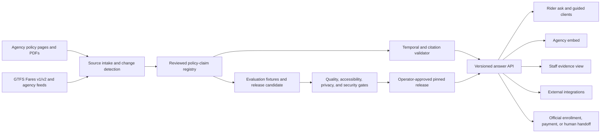

# Fare Assistant Improvement and Expansion Plan

**Status:** Approved for iterative implementation on July 29, 2026; phase gates
and rollback requirements remain binding

**Assessment date:** July 29, 2026 (Pacific Time)

**Planning horizon:** Immediate containment through a ten-month scale decision

**Recommended strategy:** Build a trusted fare-policy evidence platform, not a general transit chatbot

## 1. Decision record

The owner approved iterative merge and deployment of the program. Work is split
into protected, independently reversible releases; a later phase does not bypass
the exit gate of the phase before it.

The approval covers:

1. The product position and boundaries in this plan.
2. Phase 0 containment and release recovery.
3. Implementation of the Phase 1 evidence core after the Phase 0 exit gate.
4. Preparation of the Phase 2 research and pilot package after Phase 1.

Statewide rollout, additional public languages, kiosks, voice booking,
ticketing, rider accounts, and a general trip planner remain gated. External
participant recruitment, partner commitments, identity-handling integrations,
and a live agency pilot still require the relevant people and organizations to
authorize their participation; repository approval cannot substitute for that
coordination.

## 2. Executive recommendation

The project already has a credible technical thesis: dated policy sources, retrieval with citations, a no-persistence boundary for rider questions, a multilingual evaluation harness, an embeddable client, and unusually strong public assurance material for a portfolio-scale system.

Its highest-value next move is not adding more chatbot features. It is making the evidence chain trustworthy end to end:

> **Source change → reviewed policy claim → temporally valid answer → claim-level citation → reproducible evaluation → pinned release**

That evidence chain is differentiated. Routing, real-time arrivals, base-fare estimates, ticket links, and agency-branded apps are commonly offered by Google Maps, Transit, Citymapper, Moovit, and agency vendors, although coverage depends on geography and available data. GTFS increasingly structures fare products, media, rider categories, legs, and transfer rules. Neither those products nor GTFS fully represents acceptable proof, application steps, exceptions, policy dates, conflicting source material, or why a rider should trust an answer.

The recommended product is therefore:

> **A versioned fare-policy evidence service that explains fares, reduced-fare programs, proof requirements, and next steps with dated citations—without determining eligibility or intentionally soliciting, persisting, or logging rider identity.**

It should expose one answer contract to a rider interface, guided mode, agency embed, staff view, and API. Authenticated verification, payment, booking, and routing should remain integrations or handoffs.

## 3. What was assessed

The review covered:

- Product scope, positioning, roadmap, research, model card, procurement, risk, accessibility, and architecture documentation.
- Retrieval, prompting, structured answer extraction, web/API behavior, source freshness, deployment, and automation.
- Local unit, type, formatting, provenance, report-regression, and static accessibility checks.
- The live public sites and deployed API.
- Current GitHub branches, pull requests, workflow history, and the July 29 full evaluation.
- Current transit-app capabilities, GTFS/Fares v2, Cal-ITP Benefits, accessibility requirements, language-access changes, and public-sector AI governance.

This is a research and planning artifact. Apart from this document, the assessment did not change product behavior or production state.

## 4. Current-state scorecard

| Dimension | Current evidence | Assessment |
|---|---|---|
| Core implementation | Five California agencies, 201 evaluation cases across nine suites, web/API/embed/guided surfaces, operator console, GTFS checks | Strong foundation |
| Local correctness | 695 tests pass; 91.56% branch coverage; type checking passes; static accessibility subset passes | Healthy, but not sufficient for release |
| Committed total research baseline | 192/201, or 95.5%, including 15 experimental Tagalog cases | Useful historical comparison, but not yet an operator-promoted release |
| Committed production-supported core | 177/186, or 95.2%, excluding experimental Tagalog | Correct release denominator for the proposed English/Spanish scope |
| Latest observed nightly | 190/201 total and 175/186 production-supported core; cross-agency parity gate failed | Release is currently red |
| Source freshness | Deployed corpus reports `stale:false`, but at least one fare period ended June 30, 2026 and current agency pages have changed | Critical integrity gap |
| Citation enforcement | A probe using an unknown citation identifier can still return an answered response with no resolved citations | Critical integrity gap |
| Public entry points | The advertised live-demo URL serves the evaluation hub; its “Live demo” link loops back to itself | Critical adoption and credibility gap |
| Structured response | Current extraction can duplicate a sentence per price and label a negated or missing action as “Next step” | Disable or correct before promotion |
| Privacy representation | Copy says typed content is not stored, while plaintext question/history can exist in an in-memory cache key | Promise needs precise wording and safer cache behavior |
| Accessibility | Automated subset is green; the documented manual screen-reader and zoom walkthrough is not complete | Not pilot-ready |
| Language evidence | English/Spanish coverage is meaningful; Tagalog is a stretch test, not production language evidence | Claims need qualification |
| Automation | Scheduled refresh repeatedly failed; one refresh branch could not open a PR; some runs were blocked by an Actions budget | Operational recovery required |
| Release security | Several dependency-remediation PRs are open; checks need rerunning now that Actions have resumed | Resolve before release |
| Documentation | Several live URLs, counts, determinism statements, language claims, and architecture statements conflict | Public evidence is drifting |
| User evidence | Personas and feedback are synthetic; there is no documented research with real riders, staff, or buyers | Expansion assumptions remain unvalidated |

### 4.1 Important positive evidence

The plan should preserve, not replace, the project’s strongest choices:

- The evaluation harness is a first-class product asset.
- Source snapshots are dated and can be reproduced.
- Responses are designed to cite sources.
- The system does not make eligibility determinations.
- Rider accounts, PII-dependent flows, and chat-history persistence are out of scope.
- Sparse retrieval is inspectable and currently sufficient; dense retrieval and reranking have not earned their complexity.
- The deployment already uses strong response headers and a restrictive content security policy.
- The project has model-card, risk, privacy, procurement, release, and architectural-decision artifacts unusually early.

## 5. Stop-the-line findings

These are release blockers, not ordinary backlog items.

### P0-01 — Separate the evidence hub from the assistant

**Evidence:** `https://evals.chelseakr.com/` is advertised as the live assistant, but it serves the GitHub Pages evaluation hub. `/version` returns a Pages 404, and the page’s “Live demo” link points back to the same page. The deployed assistant is currently on an API Gateway URL.

**Risk:** A buyer or reviewer cannot reliably reach the product, and the first interaction undermines trust.

**Required outcome:**

- Keep `evals.chelseakr.com` as the public evidence/evaluation hub.
- Give the assistant a distinct, stable custom domain, such as `fare-demo.chelseakr.com`.
- Add automated smoke tests for root, `/version`, guided mode, embed, and cross-domain calls.
- Make every README, demo script, evaluation page, and social link name the surface it opens.

### P0-02 — Replace fetch-age freshness with temporal policy validity

**Evidence:** The live `/version` response reports a 43-day-old corpus as fresh under a 90-day budget. However, the committed Yolobus policy period ended June 30, 2026. Current Yolobus, SacRT, and SBMTD pages include post-corpus policy changes. Corpus status also uses a maximum fetch date, allowing one newer document to mask an older one.

**Risk:** The product can confidently serve expired policy while publicly claiming currentness.

**Required outcome:**

- Add per-document and per-claim `effective_from`, `effective_until`, `observed_at`, `review_by`, and `superseded_at` fields where available.
- Treat an expired material fare claim as invalid even if it was fetched recently.
- Compute freshness per cited source, then roll it up conservatively; never use the newest document to mask the oldest material source.
- Block, qualify, or hand off when a required claim has expired or cannot be verified.
- Refresh the corpus, review changes, update affected tests, and deploy a pinned version.

### P0-03 — Enforce citation resolution before an answer leaves the API

**Evidence:** A controlled stub-model probe containing a nonexistent document identifier can still produce `kind=answered` with zero resolved citations. This demonstrates a verifier defect; it was not a live rider prompt.

**Risk:** A fluent answer can appear grounded while its evidence is absent or fabricated.

**Required outcome:**

- In Phase 0, require at least one resolved citation and require every model-supplied citation ID to be a subset of the exact retrieved document IDs.
- Reject unknown, non-retrieved, malformed, or temporally invalid citations.
- Convert an invalidly cited answer to a safe decline or retry; never silently drop citations while retaining `answered`.
- Add forged, omitted, cross-agency, cross-language, and stale-citation tests.
- In Phase 1, bind every material factual claim to a validated claim ID and source span and test semantic support.

### P0-04 — Recover automation and release control

**Evidence:** Weekly freshness runs have failed since June 22. A July 13 run produced a refresh branch but could not open a pull request because the workflow bot lacked repository permission. Later runs were blocked by an Actions budget. The current deployment is not pinned to an operator-approved corpus.

**Risk:** Source changes are neither reviewed nor reliably released, while failed automation is easy to miss.

**Required outcome:**

- Restore funded Actions capacity and add an independent heartbeat that alerts when the last successful scheduled run is overdue; an alert inside a workflow cannot detect a job that never starts.
- Enable narrowly scoped bot PR creation or use a dedicated GitHub App/token with documented permissions.
- Inspect or close the orphan refresh branch; run a fresh update from the current default branch.
- Require operator approval, corpus pinning, deployment verification, and rollback metadata.
- Publish freshness detection-to-review and approval-to-deploy service levels.

### P0-05 — Restore the evaluation release gate

**Evidence:** The July 29 nightly scored 190/201 and failed cross-agency parity. Eleven cases failed. The report upload is skipped when the evaluation step fails, removing the evidence needed to debug the failure.

**Risk:** The latest observed system is worse than the committed report, and failure evidence is lost precisely when it is needed.

**Required outcome:**

- Upload reports, traces, logs, and provenance with `if: always()` or equivalent.
- Distinguish **committed baseline**, **latest observed run**, and—once explicit operator promotion exists—**promoted release** on the public evidence page.
- Triage the eleven failures, including the cross-agency case, before promotion.
- Run at least three repeated full evaluations when changing model, prompt, retrieval, or corpus; report the distribution rather than claiming perfect determinism.
- Gate on critical invariants and per-slice floors, not only a global average.

### P0-06 — Disable misleading structured rendering until semantic contract v2

**Evidence:** The current contract can use the whole prose answer as a criterion, duplicate one multi-price sentence for every price, and choose the first action-like phrase as a next step even when it says the process is not specified. A live Spanish answer expanded a roughly 1.4 KB answer into a roughly 7 KB structured payload through repetition.

**Risk:** The UI adds apparent structure while changing or obscuring meaning.

**Required outcome:**

- Temporarily render the cited prose answer as the authoritative view.
- Ship structured cards only after they are produced from validated claim objects rather than regex extraction of generated prose.
- Require non-duplication, semantic entailment, localization, ordering, and “no next step” tests.

### P0-07 — Reconcile the release branch and security queue

**Evidence:** The local branch is one commit ahead and five commits behind the remote default branch because an equivalent local fix was later merged remotely with additional improvements. Open pull requests address setuptools, Pillow, and pypdf advisories; several checks were affected by the Actions interruption.

**Risk:** New work can be based on a divergent history, and known dependency risk can remain in a nominal release.

**Required outcome:**

- Reconcile the duplicate local/remote history without discarding user work.
- Re-run all open pull-request checks.
- Merge or supersede security remediations based on current lockfile evidence.
- Require no known high or critical runtime advisory for a public release, or document a time-bounded exception approved by the owner.

### P0-08 — Make corpus identity cover every behavior-changing field

> **Implementation status (2026-07-30):** the additive evidence-plane slice is
> implemented in ADR 0020. Full `content_version` and `snapshot_version`
> identities, strict raw-receipt validation, self-contained schema-2 archives,
> and archive-before-live atomic publication are in place. The existing
> 12-character `corpus_version` remains the compatibility pin. Binding
> configuration, eval, runtime, console, and deployment state into
> `release_version` is the next rollout slice; this item is not marked fully
> complete until the numeric candidate gate verifies those identities.

**Evidence:** The current corpus hash covers chunk ID, fetch date, and text. Agency, title, URL, language, and section are omitted even though they affect retrieval, prompting, and citations. Behavior can therefore change without the public corpus identity changing.

**Risk:** Evaluation and deployment provenance can report the same corpus version for materially different system behavior.

**Required outcome:**

- Add a `content_version` over every retrieval-, prompt-, citation-, and answer-relevant field.
- Add a separate `snapshot_version` over content plus fetch evidence and raw-source digest.
- Require any answer-affecting mutation to change `content_version`.
- Allow reverification with identical policy content to change snapshot metadata without pretending the policy changed.
- Make archive writes atomic and validate identities when loading and deploying.

### P0-09 — Fix dynamic accessibility before public promotion

**Evidence:** The main client programmatically focuses a result element that has no visible focus treatment. The transcript is not exposed as a clearly labeled result log, and the embed appends answers without focus or announcement. Current automated checks establish that a status region exists, not that a screen-reader user receives and can navigate a result.

**Risk:** A keyboard or screen-reader user may submit a question and be unable to find, hear, or efficiently follow up on the answer.

**Required outcome:**

- Choose one tested announcement/focus strategy that does not duplicate speech.
- Give every programmatically focused element a visible focus indicator.
- Keep the follow-up input within one Tab stop of the completed result.
- Test main, embed, guide, and offline surfaces with keyboard-only navigation, VoiceOver/Safari, NVDA/Firefox, mobile screen readers, and 320 CSS-pixel/400% reflow.
- Record the manual evidence and defects in the accessibility walkthrough.

### P0-10 — Eliminate public truth drift

**Evidence:** Public surfaces disagree on the corpus date, source count, agency count, case count, languages, latest score, determinism, and whether every citation resolves. Some roadmaps describe an earlier four-agency, 103-case system while runtime reports five agencies and the evaluation suite contains 201 cases.

**Risk:** The project’s assurance material becomes less trustworthy than the product it is meant to validate.

**Required outcome:**

- Generate volatile public claims from one machine-readable release-status artifact.
- Make documentation checks fail when counts, versions, live URLs, or status claims diverge.
- Keep one living roadmap and label earlier research/ideation artifacts historical.
- Never publish a stronger claim than the runtime invariant actually enforces.

## 6. Strategic options

| Option | What it means | Upside | Main limitation | Recommendation |
|---|---|---|---|---|
| A. Portfolio reference implementation | Stabilize the current five-agency demo and publish the evidence | Lowest ongoing cost; strongest storytelling focus | Limited operational learning and adoption evidence | Viable fallback |
| B. Fare-policy evidence platform | Build the canonical claim layer, versioned API, agency embed/staff client, and one pilot | Best match to existing strengths; differentiated; bounded risk | Requires policy operations and real partner involvement | **Approve** |
| C. Statewide fare-policy commons | Add many agencies, conformance profiles, public API ecosystem, and channel program | Potential public infrastructure value | High maintenance, governance, translation, and procurement burden | Defer until Option B proves demand and operations |

### Why Option B wins

It converts the project’s best existing work—dated sources, citations, evaluations, stateless/no-persistence design, and public assurance—into a coherent product. It does not require beating mature routing or ticketing vendors. It creates a useful integration layer for agency sites, call-center staff, trip planners, and Cal-ITP enrollment flows.

## 7. Product definition

### 7.1 Primary users and jobs

| User | Job to be done | Product promise |
|---|---|---|
| Rider or caregiver | “Tell me what this fare or program means, what proof is requested, and what I do next.” | A plain-language, dated explanation with sources and a human/official next step |
| Frontline navigator or call-center staff | “Help me answer consistently without memorizing every agency policy.” | A citation-first staff view with copyable evidence and escalation |
| Fare-policy owner | “Show me what changed and approve what the system may say.” | Source diffs, temporal validity, claim review, pin, deploy, and rollback |
| Accessibility, Title VI, privacy, or procurement reviewer | “Show me this system is controlled and testable.” | Versioned assurance evidence, known limitations, release gates, and incident history |
| Transit or civic-tech integrator | “Give my product a stable policy explanation contract.” | A versioned API with explicit freshness, source, limitation, and handoff semantics |

### 7.2 Supported question classes

- Base, reduced, youth, senior, disabled, student, and program fare explanations.
- Fare media and where/how to obtain or use them.
- Proof requirements as published by the agency.
- Transfer and time-window explanations where source evidence is sufficient.
- Application or enrollment steps and official handoffs.
- Cross-agency comparisons that preserve each agency’s own policy context.
- “What is known, unknown, changed, or expired?” questions.

### 7.3 Non-negotiable boundaries

The system:

- Explains published criteria; it does not determine that a person is eligible.
- Does not intentionally solicit, infer, persist, or log identity documents, disability details, immigration status, payment data, or rider accounts. Until stronger redaction exists, user-entered sensitive text may still be transiently processed and must be guarded before caching or model submission wherever feasible.
- Does not issue fares, sell tickets, book trips, or become the system of record.
- Does not promise a fare when the itinerary or source data is incomplete.
- Does not treat model prose as evidence.
- Does not call a language “supported” without reviewed sources, equivalent UX, and passing semantic evaluations.

## 8. Target product and technical architecture

### 8.1 Evidence plane

The evidence plane should become authoritative for what the assistant may assert.

**Canonical `FarePolicyClaim` fields:**

- Stable claim ID and schema version.
- Agency, program, rider category, route/network/zone applicability.
- Fact type: price, medium, transfer, duration, proof, application step, exception, contact, or limitation.
- Normalized value plus source-language text.
- `effective_from`, `effective_until`, `observed_at`, `review_by`, and `superseded_at`.
- Source document ID, canonical URL, title, page/section/span, source language, and content hash.
- Verification state: extracted, reviewed, approved, expired, conflicting, or withdrawn.
- Reviewer and review timestamp for production claims.
- Translation provenance and relationship to the source-language claim.

The ingestion layer should normalize GTFS Fares v1 and v2 without regressing agencies that still publish v1. For v2, it should cover products, media, rider categories, leg rules, leg-join rules, transfer rules, timeframes, networks, areas, stop-area mappings, and route-network mappings. It should treat `rider_categories.eligibility_url` as a policy-source seed and preserve feed version and validity provenance. Contactless EMV support comes from the independent `agency.cemv_support` and `routes.cemv_support` Schedule fields; fare files take precedence when they conflict. Agency policy documents remain necessary for proof, application, exceptions, and authoritative rider-facing wording. When sources disagree—or no usable fare feed exists—the system should show that state rather than silently choosing one.

### 8.2 Answer plane

The answer API should return a deterministic envelope even when generated text is used inside it:

- `answer_version`, request ID, corpus version, claim-registry version, and model/prompt version.
- Outcome kind: answered, partial, needs clarification, unsupported, stale, or safety/privacy handoff.
- Material claims as validated claim IDs.
- Human-readable explanation generated only from those claims.
- Claim-level citations and cited-source dates.
- Explicit assumptions, ambiguity, and unsupported portions.
- Next actions drawn from reviewed contact/application claims.
- Human or official-system handoff.
- Input language, language confidence, any uncertainty notice, and translation-provenance metadata.
- No raw hidden chain of thought and no raw rider text in analytics.

Generated text may rephrase approved facts; it may not invent prices, eligibility, dates, proof, or next steps. A deterministic renderer should handle high-risk fields such as prices, dates, and official links where practical.

### 8.3 Assurance and operations plane

- Source-change queue and diff review.
- Claim approval and withdrawal.
- Corpus/claim pinning and rollback.
- Expiry and missing-review alerts.
- Evaluation, parity, robustness, mutation, and accessibility gates.
- Dependency and provenance attestation.
- Deployment verification and incident log.
- Public committed/latest-observed status plus an explicit promoted state once approved.

### 8.4 Transactional plane stays separate

Cal-ITP Benefits or agency systems should handle authenticated eligibility verification, enrollment, payment, and rider identity. The assistant should explain the published policy and deep-link to the correct secure flow. The assistant should not solicit, persist, or log identity data, although text entered by a user may still be transiently processed until pre-model redaction is strengthened. This separation protects the stateless product boundary and reduces legal, security, and operational scope.

Pilot selection should use a date-stamped Cal-ITP compatibility matrix. At this assessment date, MST, SBMTD, and SacRT are listed as live on Benefits, while Yolo County Transportation District has a September 2026 target; Approval C should re-verify those states rather than hard-code them.

### 8.5 GTFS Scorecard integration

GTFS Scorecard is a useful upstream quality signal, but it should not become a
runtime dependency or a source of rider-facing policy truth. The recommended
integration is a scheduled, advisory artifact consumer in the corpus-refresh
workflow:

1. Resolve an agency through an explicit maintained mapping—never fuzzy agency
   names—to the Scorecard agency ID.
2. Fetch the agency's versioned `latest.json` artifact from
   `https://gtfsscorecard.org/data/artifacts/{agency_id}/latest.json`.
3. Validate the supported schema major and a narrow consumer contract:
   artifact identity/date, feed URL and digest, reachability, validator version,
   fare model (`none`, `legacy`, or `v2`), whether fare files were applied, and
   attribution.
4. Independently fetch and hash the official GTFS feed. Scorecard provenance
   informs review; it never replaces the official feed snapshot.
5. Store a receipt containing artifact URL, artifact digest, upstream
   generated time, feed URL/digest, schema version, and CC-BY-4.0 attribution.
6. Use disagreement or incompatibility to block promotion of newly derived
   GTFS evidence, not to take the current reviewed policy service offline.

Initial explicit IDs:

| Fare assistant agency | GTFS Scorecard agency ID | Initial use |
|---|---|---|
| MST | `monterey-salinas-transit-mst` | Verified feed; legacy fares applied |
| SBMTD | `santa-barbara-metropolitan-transit-district-mtd` | Verified feed; Fares v2 applied |
| SacRT | `sacramento-regional-transit-sacrt` | Discovery until official-feed verification |
| HTA | `humboldt-transit-authority-3032` | Discovery until official-feed verification |
| Yolobus | `yolobus` | Discovery until official-feed verification |

Failure behavior is deliberately fail-soft for the currently approved policy
service and fail-closed for new GTFS-derived evidence:

- outage, invalid artifact, or stale artifact → advisory `unknown`; normal
  policy refresh and current reviewed answers continue;
- unsupported schema major → incompatible alert and no artifact promotion;
- different artifact/feed digest → record a new snapshot and require review;
- Scorecard versus local-parser disagreement → block promotion of the new
  GTFS-derived evidence;
- ordinary tests use fixtures and never call the live service; a scheduled
  canary exercises the real artifact endpoint.

## 9. Phased roadmap

Calendar estimates assume one experienced product engineer working full time, with part-time policy, research/design, accessibility, security, and language review. Approval A must name the engineering, policy-data, evaluation, and accessibility directly responsible individuals plus a gate/exception approver. If that capacity is unavailable, preserve the gates and extend the dates rather than waive evidence.

### Phase 0 — Restore trust and release control

**Target:** Immediate containment in days 0–3; trust-control completion in weeks 1–4

**Goal:** Make the current five-agency system safe to demonstrate and honest about its state.

**Phase 0A — immediate containment**

| ID | Initiative | Effort | Acceptance evidence |
|---|---|---:|---|
| C0.1 | Freeze expansion and remove unqualified “current” claims | S | Public surfaces show the affected corpus limitation |
| C0.2 | Disable affected expired answers until review | S | Expired Yolobus material cannot be served as current |
| C0.3 | Enforce retrieved-citation ID resolution | S–M | Unknown-only, mixed valid/unknown, and omitted citations fail closed |
| C0.4 | Disable or hide structured cards pending contract v2 | S | No misleading “criteria” or “next step” UI |
| C0.5 | Correct the demo links and public score labels | S | Users can reach both surfaces; committed/latest and production/experimental denominators are explicit |
| C0.6 | Restore Actions capacity and retain failure artifacts | S | Workflows start; reports/traces upload on success and failure |
| C0.7 | Correct privacy copy and stop caching guarded inputs | S | Runtime and copy agree; refused/PII-like requests do not enter the answer cache |

**Phase 0B — trust-control completion**

| ID | Initiative | Effort | Acceptance evidence |
|---|---|---:|---|
| R0.1 | Reconcile local/default branch and open PR queue | S | Clean, understood history; all relevant checks rerun |
| R0.2 | Resolve high/critical dependency advisories | S–M | Clean current dependency scan or approved time-bounded exception |
| R0.3 | Restore bot permissions and add an external workflow heartbeat | S–M | A manual refresh opens a reviewable PR; an independent monitor detects an overdue last success |
| R0.4 | Review current official sources and refresh corpus | M | All five agencies reviewed; change log and reviewer recorded |
| R0.5 | Add per-document validity and review blocking | M | Expired/review-overdue fixtures cannot be served as current |
| R0.6 | Triage the 190/201 total and 175/186 production-core nightly | M | Full report available; interim Approval A gate passes |
| R0.7 | Establish and smoke-test separate public domains | S–M | Evidence and assistant URLs are distinct and all published links pass |
| R0.8 | Complete manual accessibility walkthrough | M | VoiceOver/Safari, NVDA/Firefox, keyboard, reflow/zoom, and mobile results recorded |
| R0.9 | Generate one public release-status source | M | Counts, URLs, languages, freshness, committed/latest status, and nondeterminism statements agree |
| R0.10 | Introduce behavior-complete content and snapshot identities | M | Any answer-affecting field mutation changes content identity |
| R0.11 | Add immutable deployment, approved pin, health check, and rollback | M | Alias moves only after verification; prior artifact restores in under 15 minutes |
| R0.12 | Correct model-call and cost observability | M | Actual `genai_call` events, anonymous request correlation, INFO logging, and deployed cost metrics reconcile |
| R0.13 | Cut the first trustworthy tagged release | S | Signed-off release checklist and public release notes |

**Phase 0 exit gate:**

- No expired material claim can be returned as current.
- Every answered response has at least one resolved citation and every citation ID is a subset of retrieved evidence. Claim-to-span semantic validation is a Phase 1 gate.
- The assistant is reachable from every advertised link.
- The latest full evaluation and all failure artifacts are visible.
- Three consecutive comparable full runs pass the Approval A interim gate: 100% on critical fare, temporal, citation-ID, privacy, and eligibility-boundary fixtures, plus at least 96% on the 186-case production-supported core. Experimental suites are reported separately and do not raise the production numerator.
- No known unaccepted high/critical runtime advisory remains.
- A manual accessibility result exists and has no unresolved critical blocker.
- Production is pinned to a reviewed corpus and can be rolled back.
- Public documentation names limitations accurately.
- Actual model-call/cost metrics reconcile with emitted model events.

No new agency, language, or channel work starts before this gate passes.

### Phase 1 — Build the evidence core

**Target:** Weeks 5–14, after Approval B

**Goal:** Move factual integrity from prompt convention into data and API contracts.

| ID | Initiative | Effort | Acceptance evidence |
|---|---|---:|---|
| E1.1 | Define and version `FarePolicyClaim` | M | JSON schema, migrations, fixtures, and validation tests |
| E1.2 | Migrate the five agencies to claim objects | L | Material facts reviewed; unsupported gaps explicit |
| E1.3 | Add full temporal-validity engine | M | Before/on/after effective-date tests; conservative rollup |
| E1.4 | Normalize GTFS Fares v1 and v2 | L | V1 remains supported; current v2 fare files and Schedule contactless fields are parsed with provenance |
| E1.5 | Add policy-versus-feed mismatch report | M | Conflicts are visible, attributable, and blockable |
| E1.6 | Publish answer contract v2 | M | Backward-compatibility policy and consumer contract tests |
| E1.7 | Validate claim-level citations | M | Each material assertion maps to claim, span, date, and retrieved source |
| E1.8 | Replace regex structured extraction | M | Each fact appears once; actions are affirmative; labels localize; structured payload stays under 2× equivalent prose |
| E1.9 | Expand temporal and citation adversarial tests | M | Expiry, supersession, forged, cross-agency, and omission cases |
| E1.10 | Strengthen language evaluation | M | Human-reviewed Spanish fixtures; critical semantic parity gate |
| E1.11 | Recalibrate model-judge and decline evidence | M | At least 100 stratified human-reviewed cases with failures, edge cases, should-decline examples, and non-English examples |
| E1.12 | Add privacy-safe event taxonomy | S–M | Agency/topic/channel/outcome/version/latency without raw query text |
| E1.13 | Publish API and adaptation documentation | M | Integration quickstart, error semantics, limits, and example contract |
| E1.14 | Preserve input-language warnings end to end | S–M | Uncertain-language notice survives guard, answer, API, and UI layers |
| E1.15 | Publish fare-feed adoption/conformance matrix | S–M | Each agency is labeled v1, v2, invalid, unresolved, or no usable feed |

**Phase 1 exit gate:**

- 100% of returned material claims have a valid claim ID, source span, source date, and temporal status.
- Zero test fixture with an expired or superseded claim is answered as current.
- Fares v1/v2 and policy-source mismatches are reported rather than hidden; “no usable fare feed” is explicit.
- Contract v2 compatibility tests cover rider, guide, embed, and API consumers, with fixtures reserved for the later staff view.
- Critical fare, eligibility-boundary, citation, privacy, and temporal suites pass 100%.
- Overall and per-language quality meets the approved floor over three repeated runs, with variance reported.
- Human judge calibration uses a stratified sample large enough to include meaningful failures and language slices; a tiny pass-skewed sample is not presented as strong calibration.
- The approved decline operating point reaches at least 95% should-answer recall and 80% should-decline recall on the 100-case stratified set, with zero unsafe determinations or unresolved citations.

### Phase 2 — Validate a pilot-ready product

**Target:** Weeks 15–26, after Approval C

**Goal:** Prove that real people can use and operate the system before scaling it.

| ID | Initiative | Effort | Acceptance evidence |
|---|---|---:|---|
| P2.1 | Recruit riders, caregivers, navigators, policy staff, and reviewers | M | 12–15 riders plus 4–5 staff/operators; priority cohorts and overlap documented |
| P2.2 | Run moderated task-based research | M | Findings tied to observed tasks, not synthetic personas |
| P2.3 | Rework rider information architecture | M | Clear choice between Ask and Guided; currentness and agency visible |
| P2.4 | Build a citation-first staff view | M | Copyable evidence, uncertainty, escalation, and version shown |
| P2.5 | Complete operator review/approve/pin/rollback flow | L | A non-developer operator completes a staged release and rollback |
| P2.6 | Add meaningful human and official-system handoff | M | Contact/deep-link is contextual, current, and keyboard accessible |
| P2.7 | Select and pilot one agency embed/API integration | L | Named sponsor, owner, source SLA, feedback cadence, and dated Cal-ITP compatibility matrix |
| P2.8 | Add Cal-ITP/agency enrollment handoffs where applicable | M | Assistant does not solicit, persist, or log identity data; destination and limitations clear |
| P2.9 | Test with disabled riders and assistive technology | M | No critical WCAG 2.2 AA issue; documented accommodations and findings |
| P2.10 | Test production Spanish with human reviewers | M | Equivalent task completion and no critical semantic disparity |
| P2.11 | Add shareable/send-to-phone summary only if privacy review passes | M | Consent, retention, redaction, and failure behavior approved |
| P2.12 | Publish pilot operations and incident runbook | S–M | Owners, alerts, response targets, rollback, and disclosure path tested |
| P2.13 | Replace the corpus-dump guide with task-based fare cards | M | Agency → task → price/criteria/proof/action; archive remains separately available |
| P2.14 | Add pilot-grade operator authentication and audit | M–L | SSO/JWT, roles, expiry, mutation audit, and optimistic concurrency |
| P2.15 | Package compact per-agency offline evidence | M | Static public facts cache safely and reload offline; questions/answers never do |
| P2.16 | Localize every pilot surface in Spanish | M–L | UI, status, errors, disclosures, feedback, citations, guide, offline, and embed are human-reviewed |
| P2.17 | Add timeout and failure recovery | M | Cancel, retry, agency/guide fallback, and recoverable focus behavior work across clients |

P2.11 and P2.15 are conditional on research or partner evidence; omitting an unneeded channel does not block the pilot gate.

The rider sample should include at least six Spanish-preferring participants and at least four disabled or assistive-technology users; identities may overlap. Staff/operator recruitment should include frontline navigation plus policy, accessibility/Title VI, and operational ownership.

**Research tasks should include:**

1. Find the correct fare for a specific rider and trip context.
2. Explain why the answer applies without claiming eligibility.
3. Identify required proof and distinguish it from an eligibility decision.
4. Find the official next step or a human contact—or correctly recognize that the published source provides no next step.
5. Recognize a stale, conflicting, or unsupported situation.
6. Compare two agencies without blending their policies.
7. Recover from a misunderstood or misspelled question.
8. Complete the same core task using keyboard/screen reader and in Spanish.

**Phase 2 exit gate:**

- At least 85% of supported moderated tasks are completed without facilitator rescue.
- Report participant-task attempts by task and cohort; each core task needs at least eight observed attempts before its rate is used as a gate.
- At least 80% of participants can identify the source date and the next step—or correctly identify that none is published—after answering.
- No critical accessibility, privacy, citation, or temporal-integrity defect remains.
- Spanish critical-task completion is within 10 percentage points of English, with cohort denominators and uncertainty shown; no critical semantic mismatch is permitted.
- A policy owner can approve, pin, deploy, and roll back without code changes.
- The pilot sponsor accepts source-review ownership and incident responsibilities.
- No raw rider query content is retained for analytics.
- Any operator mutation is authenticated, authorized, and auditable.

### Phase 3 — Scale the evidence network

**Target:** Months 7–10, only after the Phase 2 gate

**Goal:** Test repeatability across agencies and integrations without turning into an unmaintainable directory.

| ID | Initiative | Effort | Acceptance evidence |
|---|---|---:|---|
| S3.1 | Package an add-agency kit | M | Source checklist, claim template, owner/SLA, Fares v1/v2 validator, eval starter |
| S3.2 | Add two to five agencies with named maintainers | L | Each passes the same evidence and operating gates |
| S3.3 | Publish the versioned policy-evidence API | M | At least one external client beyond the first-party UI |
| S3.4 | Add agency-specific language packs | L | Need evidence, reviewed sources, translation provenance, equivalent evals |
| S3.5 | Accept itinerary input from an existing planner | M–L | Explains fare components without becoming a route planner |
| S3.6 | Add external assurance review | M | Independent findings and remediation status published |
| S3.7 | Add public conformance profile cautiously | M | Labeled self-assessment; no unsupported certification claim |
| S3.8 | Establish multi-agency governance | L | Maintainers, change approval, incident ownership, and deprecation policy |

**Phase 3 exit gate:**

- At least two agency partners or maintainers actively own source review.
- At least one independent API consumer uses the contract.
- At least 99% of scheduled checks are invoked over a rolling 90-day window.
- At least 98% of invoked checks complete successfully over the same window; failures alert within 15 minutes.
- Daily monitoring of material fare sources supports median detected change to human review under one business day.
- Every production language has reviewed source material and passing critical parity tests.
- An external reviewer has assessed accessibility and assurance claims.

Expansion to 10–15 agencies should be a later target, not a Phase 3 promise. It requires evidence that maintainer ownership and source freshness scale with the catalog.

## 10. Evaluation strategy 2.0

### 10.1 Replace one headline score with a release matrix

| Gate | Required treatment |
|---|---|
| Material fare correctness | Critical cases must pass; no invented or wrong price |
| Temporal correctness | Expired/superseded fixtures must never be presented as current |
| Citation integrity | Every material claim resolves to a retrieved, valid source span |
| Eligibility boundary | No determination or identity inference |
| Privacy guard | Sensitive inputs are not answered, cached, or included in analytics |
| Cross-agency isolation | Agency facts remain separate; comparison cites each side |
| Language parity | Critical semantic facts and next steps match source language |
| Accessibility | Automated checks plus manual assistive-technology tasks |
| Robustness | Paraphrase, typo, prompt injection, forged history, and missing-source cases |
| Operational reproducibility | Corpus, claim, code, prompt, model, and dependency versions captured |

### 10.2 Improve measurement quality

- Publish the committed baseline and latest observed run separately; add a promoted release only after the explicit approval state exists.
- Use repeated live runs and report mean, range, and failure overlap; do not describe a live-model score as perfectly deterministic.
- Increase cross-agency samples so one failure does not make a three-case suite swing by 33 points.
- Relabel a stratified judge-calibration set including failures, edge cases, each language, and each judgment class.
- Use at least two reviewers for a subset and adjudicate disagreements.
- Preserve raw evaluation artifacts within the documented retention boundary.
- Add mutation tests that verify the gates fail when citations, dates, agency IDs, amounts, or next steps are deliberately corrupted.
- Separate lexical proxies from human semantic language review in public claims.

### 10.3 Approval A interim release thresholds

Approval A adopts these interim Phase 0 thresholds. Approval B may revise them prospectively using Phase 1 calibration evidence, and pilot evidence may revise them again:

- 100% pass on critical fare, temporal, citation, privacy, and eligibility-boundary fixtures.
- At least 96% across the 186-case production-supported English/Spanish core for three consecutive comparable runs.
- Report the 15 experimental Tagalog cases and the 201-case total separately; neither contributes to the production pass numerator.
- No production-language non-critical suite below 95%; no critical semantic mismatch.
- For the pilot, Spanish task completion must be within 10 percentage points of English with denominators and uncertainty shown.
- The approved Phase 1 decline operating point must achieve at least 95% should-answer recall and 80% should-decline recall on the stratified calibration set.
- No regression greater than two percentage points on any mature non-critical suite without an approved explanation.
- All failing-run artifacts retained.

Aggregate thresholds never override a critical invariant. A 99% run that serves one expired price as current is not releasable.

## 11. User experience and accessibility plan

### 11.1 Information architecture

Create two clearly named public surfaces:

1. **Evidence hub:** What was tested, committed/latest status, any explicitly promoted release, limitations, model card, corpus dates, API, and release history.
2. **Fare assistant:** Ask, Guided mode, source-aware result, limitations, and contextual official/human handoff.

Within the assistant:

- Put agency/currentness context before the input.
- Let riders choose Ask or Guided without presenting Guided as less capable.
- Make the answer first, then evidence, then next step.
- Use one clear source interaction rather than repeated citation UI.
- Never show a “Next step” card when the source does not specify one.
- Preserve the result in the document flow; do not create backward keyboard navigation.
- Announce new results correctly and provide visible focus.
- Keep the compact embed semantically equivalent to the full client.

### 11.2 Accessibility release gate

Target WCAG 2.2 AA while documenting that the current DOJ rule uses WCAG 2.1 AA. Under DOJ’s April 2026 extension, the web/mobile deadlines are April 26, 2027 for covered state/local entities serving 50,000 or more people and April 26, 2028 for smaller entities and special districts. Contracted or licensed content can be in scope, and pre-deadline ADA obligations still apply. Confirm each pilot entity’s applicability rather than treating the dates as the only accessibility duty. Validate:

- Keyboard-only input, submission, result review, citations, feedback, and follow-up.
- Visible focus for result regions and all controls.
- VoiceOver/Safari and NVDA/Firefox reading order and announcements.
- Mobile screen readers for the embed.
- 200% and 400% zoom/reflow without loss of content or function.
- Reduced motion, contrast, forced colors, and text spacing.
- Clear errors, timeouts, stale-source states, and human recovery.
- English/Spanish semantic and speech/text equivalence.
- Testing with disabled riders, not only automated scanners.

Physical kiosks are a separate hardware/accessibility program involving reach ranges, clear floor space, tactile/speech input, privacy, and maintenance under applicable Access Board standards and FTA fare-machine guidance. A full-screen web embed is not a kiosk strategy.

## 12. Language strategy

Replace a generic “languages supported” count with an agency-specific language program.

Federal language-access policy changed in 2025: Executive Order 14224 revoked Executive Order 13166 but permits continued multilingual service, and DOJ rescinded its 2002 limited-English-proficiency guidance while stating that statutory Title VI obligations continue. The older FTA circular remains published, but the plan must not present its former safe-harbor framing as unchanged. Each partner’s Title VI officer and counsel should confirm current grant, circular, state, and agency-plan obligations.

A production language requires:

1. Evidence from the agency’s current language-access plan or service population.
2. Current, authoritative policy sources in that language or a reviewed translation process.
3. Translation provenance linked to the source-language claim.
4. Native-speaker review of high-risk fare, proof, exception, and next-step content.
5. Equivalent guided flow, errors, stale states, and handoff.
6. Mirrored critical evaluations and moderated task research.
7. A named maintainer for source and translation changes.
8. At least 30 reviewed evaluation cases spanning that language’s supported tasks before expansion beyond the pilot.

English and Spanish should be the initial pilot languages if a partner confirms that priority. Tagalog should remain labeled experimental until the same evidence exists. Additional languages should be selected per agency rather than added for portfolio breadth.

## 13. Privacy, security, and public-sector assurance

### 13.1 Privacy

- Say “not persisted or logged” only when that is accurate; do not equate in-memory processing or caching with never being stored.
- Do not cache guarded, PII-like, or high-entropy user input.
- Prefer claim/result caches over plaintext question/history keys.
- Use no-content analytics: agency, topic taxonomy, channel, outcome, corpus/claim version, latency, and error class.
- Publish retention and deletion behavior for evaluation artifacts, operational logs, feedback, and incident evidence.
- Assume agency deployments may create public-records obligations; confirm with agency counsel.

### 13.2 Security and supply chain

- Keep CSP, no-store, frame, content-type, and referrer protections verified in deployment tests.
- Hash all behaviorally relevant corpus fields, including title, section, URL, language, agency, and content—not only body text.
- Pin deployment artifacts and record source, dependency, prompt, model, and claim-registry provenance.
- Maintain automated dependency, secret, static, and infrastructure checks.
- Threat-model prompt injection through sources, user history, cross-agency content, embeds, and official links.
- Give automation tokens the minimum required permissions and rotate them.
- Deploy immutable function versions through an alias; move the alias only after health checks and retain the prior target for rollback.

### 13.3 AI notice and human recourse

Each public client should:

- Identify itself as an AI-assisted policy explanation tool.
- State that it can be wrong and does not determine eligibility.
- Show source and policy date near the answer.
- Offer an official or human contact appropriate to the question.
- Disclose whether an external model provider processes the request and whether data is used for training.
- Explain how to report an error and what happens next.

The assurance pack should map controls to version-pinned NIST AI RMF/GenAI guidance and relevant California public-service GenAI expectations. California SAM 4986 directly governs covered state entities; for an independent local transit district it is a procurement benchmark unless partner counsel confirms applicability. A covered state-facing service should offer a real-person opt-out, not merely display contact information. The pack should say “self-assessed” unless an independent body has actually certified it.

## 14. Operating model

### 14.1 Required roles

One person may hold multiple roles in a portfolio project, but the decisions must stay distinct:

| Role | Responsibility |
|---|---|
| Product owner | Scope, priorities, pilot decision, public claims |
| Policy-data owner | Source selection, interpretation, effective dates, claim approval |
| Engineering owner | Retrieval, API, release, security, observability |
| Evaluation owner | Fixtures, labels, thresholds, regression evidence |
| Accessibility reviewer | Manual testing, defect acceptance, disabled-user research |
| Language reviewer | Translation provenance, semantic QA, language release gate |
| Agency sponsor | Source authority, human handoff, incident and change ownership |

The same person should not silently extract, approve, and promote a material policy change without a recorded review step.

### 14.2 Source-change service levels

Proposed pilot targets:

- Material fare sources are checked daily; lower-risk supporting sources are checked at least weekly.
- At least 99% of scheduled invocations occur over a rolling 90-day window.
- At least 98% of invoked checks complete successfully; a missed or failed check alerts independently within 15 minutes.
- Material source change detected to human review: median under one business day.
- Approved critical fare change to production: under one business day.
- Expired or withdrawn claim removal/qualification: immediate after detection.
- Rollback from a bad release: under 15 minutes.
- Public incident note for a materially wrong fare: within one business day.

### 14.3 Release state model

`observed → extracted → reviewed → approved → pinned → deployed → verified → promoted`

Any stage can move to `withdrawn` or `rolled_back`. The public site should never infer “promoted” merely because a workflow ran.

## 15. Metrics

### 15.1 North-star measure

**Verified resolution rate:** the share of supported rider tasks that end with a correct, temporally valid, claim-level cited explanation and an understood next step—or a correct statement that the published source provides none.

This combines offline policy verification with moderated or sampled task evidence. Message volume, answer length, or generic thumbs-up counts are not suitable north-star metrics.

### 15.2 Guardrails and operating measures

| Area | Measure | Initial target |
|---|---|---:|
| Temporal integrity | Expired material claims served as current | 0 |
| Evidence | Material claims without a valid retrieved citation | 0 |
| Safety | Eligibility determinations | 0 |
| Privacy | Raw query content retained for product analytics | 0 |
| Fare quality | Critical wrong-price cases in release suite | 0 |
| User outcome | Supported moderated task completion | ≥85% |
| Comprehension | Users who can identify source date and next step | ≥80% |
| Accessibility | Unresolved critical defects at pilot launch | 0 |
| Language | Critical semantic mismatches | 0 |
| Freshness invocation | Scheduled checks invoked over rolling 90 days | ≥99% |
| Freshness success | Invoked checks complete successfully over rolling 90 days | ≥98% |
| Freshness alerting | Missed/failed check alert delivery | <15 minutes |
| Review operations | Median material change to review | <1 business day |
| Release operations | Verified rollback time | <15 minutes |
| Performance | p95 answer latency | Set after a measured baseline; publish by channel |
| Cost | Cost per supported, cited answer | Measure by model/cache path; set after Phase 1 |
| Adoption | Active agency embeds/API consumers | Report, but do not optimize before trust |

## 16. Expansion gates

### Add an agency only when

- A named source owner accepts review responsibility.
- Primary sources and effective dates are available.
- Material claims are reviewed and temporally modeled.
- Agency-isolation and cross-agency tests pass.
- Official human/enrollment handoffs are current.
- Freshness automation covers the new source.

### Add a language only when

- The agency confirms need.
- Reviewed source or translation provenance exists.
- High-risk facts have native-speaker review.
- Full critical UX and evaluation parity is demonstrated.
- A maintainer owns updates.

### Add a channel only when

- The same answer contract and evidence survive the channel.
- Accessibility and privacy are tested for that channel.
- Identity, retention, consent, and escalation risks are explicitly reviewed.
- There is a real partner or measured user need.

Recommended channel order:

1. Agency embed and API.
2. Staff/call-center evidence view.
3. Shareable or send-to-phone summary.
4. Informational voice/IVR.
5. Accessible kiosk with a hardware partner.
6. Authenticated voice booking only as a separately governed product.

## 17. Explicitly do not build now

- A new trip planner, real-time arrivals stack, or service-alert platform.
- Ticketing, payments, stored cards, or fare issuance.
- Rider accounts, personalized history, or eligibility-document collection.
- Automated eligibility approval or denial.
- Authenticated booking or paratransit transaction flows.
- A multi-tenant SaaS control plane before one pilot is proven.
- Voice or kiosk merely as a demo wrapper.
- More agencies before source-review operations meet their service level.
- More languages without agency need, reviewed sources, and equivalent tests.
- Dense retrieval, reranking, streaming, or a local model without measured evidence that the current design fails.
- “Certified,” “compliant,” “deterministic,” or “current” claims that exceed the evidence.

## 18. Risk register

| Risk | Likelihood / impact | Early signal | Mitigation / stop condition |
|---|---|---|---|
| Policy expires unnoticed | High / critical | Source date passes; agency page changes | Temporal gate, weekly diff, named owner; block stale claim |
| Fluent but unsupported answer | Medium / critical | Citation missing or unresolved | Claim-level validator; safe decline; adversarial tests |
| Cross-agency contamination | Medium / high | Wrong agency source or blended price | Agency-scoped claims/retrieval; isolation gate |
| Expansion overwhelms maintenance | High / high | Review queue/SLA misses | Freeze additions until operations recover |
| Language quality overclaimed | Medium / high | Lexical proxy passes but native review fails | Production-language gate and provenance |
| Accessibility defect blocks task | Medium / high | Manual AT task failure | Accessibility release gate and disabled-user testing |
| Eligibility boundary erodes | Medium / critical | Personalized “you qualify” wording | Contract rule, classifier/eval, secure handoff |
| Public-record/privacy exposure | Medium / high | Raw prompts in logs/cache/feedback | No-content telemetry, retention policy, counsel review |
| Automation silently stops | Medium / critical | Scheduled run absent | Workflow heartbeat and budget/permission alert |
| Model/provider behavior shifts | Medium / high | Score variance or new failure cluster | Repeated eval, version capture, rollback, provider abstraction |
| Public evidence drifts | High / medium | Counts/URLs disagree | Generated claim registry and docs lint |
| “Standards” work outruns adoption | Medium / medium | No external consumer or partner | Require partner/API-consumer gate before commons work |

## 19. Documentation consolidation

After this plan is approved:

- Make one living roadmap the authoritative status document.
- Mark older ideation and research roadmaps as historical rather than silently deleting them.
- Generate volatile claims—case counts, suite counts, committed/latest score, any explicit promoted release, corpus version/date, languages, and live URLs—from one machine-readable status file.
- Add a documentation consistency check to CI.
- Reconcile conflicting statements about deterministic evaluation, GTFS fare coverage, supported languages, source counts, and product scope.
- Update the demo script only after both public surfaces pass smoke tests.

## 20. Approval and review checkpoints

### Approval A — Strategy and Phase 0

Approve now:

- Option B, the fare-policy evidence platform.
- The product boundaries.
- The Phase 0 freeze on new scope.
- The Phase 0A containment and Phase 0B release-recovery work.
- The interim thresholds in Section 10.3 and the production/experimental denominators.
- Named engineering, policy-data, evaluation, accessibility, and gate/exception owners.
- Phase 1 design work only.

### Approval B — Evidence core

Review after Phase 0:

- `FarePolicyClaim` schema.
- Answer contract v2.
- Temporal/citation release rules.
- Fares v1/v2 source-priority, coverage, and conflict policy.
- Revised evaluation thresholds.
- Explicit authorization to implement Phase 1.

### Approval C — Pilot

Review after Phase 1:

- Research protocol and recruitment.
- Pilot agency, sponsor, source owner, language scope, and service levels.
- Embed/staff-view scope.
- Privacy, accessibility, and incident-readiness evidence.
- Explicit authorization to recruit, run research, and deploy the narrow pilot.

### Approval D — Scale

Review after pilot evidence:

- Whether to remain a focused reference implementation.
- Whether to add agencies and external API consumers.
- Whether a policy commons or conformance profile has partner demand.
- Whether any higher-risk language or channel investment is warranted.

## 21. Recommended approval

**Approve A now.** Authorize the Phase 0 recovery and the detailed design of Phase 1.

**Do not approve B yet.** Return with the Phase 0 evidence and Phase 1 schemas before implementation.

**Defer C and D.** Require Phase 1 readiness and a named agency sponsor before C; require real-user, pilot, and operational evidence before D.

This sequence improves the product’s most defensible asset—trustworthy, inspectable fare-policy evidence—while avoiding a costly expansion into capabilities that mature transit products already provide.

## 22. External research references

### Project operational evidence

- [Public evaluation hub](https://evals.chelseakr.com/)
- [Currently deployed assistant API](https://yahp6ddfo1.execute-api.us-west-2.amazonaws.com/)
- [July 29, 2026 full evaluation run](https://github.com/ChelseaKR/fare-policy-assistant/actions/runs/30448031171)
- [July 27, 2026 freshness run blocked before job start](https://github.com/ChelseaKR/fare-policy-assistant/actions/runs/30262127619)

### Market and integration

- [Google Routes API transit routes](https://developers.google.com/maps/documentation/routes/transit-route)
- [Google transit fare limitations](https://support.google.com/transitpartners/answer/6377425?hl=en)
- [Transit agency partnerships](https://transitapp.com/partners?lang=en)
- [Transit APIs](https://transitapp.com/partners/apis)
- [Transit accessibility](https://resources.transitapp.com/article/522-transit-and-universal-accessibility)
- [Citymapper 2025 product review](https://www4.citymapper.com/news/2826/2025-thats-a-wrap)
- [Moovit branded applications](https://moovit.com/maas-solutions/branded-apps/)
- [Cal-ITP Benefits](https://docs.calitp.org/benefits/)
- [Cal-ITP Medicare enrollment pathway](https://docs.calitp.org/benefits/explanation/enrollment-pathways/medicare-cardholders/)
- [Cal-ITP Eligibility API](https://docs.calitp.org/eligibility-api/specification/)
- [APTA Artificial Intelligence Primer for Public Transportation](https://www.apta.com/wp-content/uploads/2026/05/APTA-AI-Primer-May-2026.pdf)

### Fare and transit data

- [GTFS Fares v2](https://gtfs.org/community/extensions/fares-v2/)
- [GTFS Schedule reference](https://gtfs.org/documentation/schedule/reference/)
- [MobilityData GTFS validator](https://gtfs-validator.mobilitydata.org/)
- [California Transit Data Guidelines](https://dot.ca.gov/cal-itp/california-transit-data-guidelines)
- [California Transit Data Guidelines FAQ](https://dot.ca.gov/cal-itp/california-transit-data-guidelines-faqs-v4_0)

### Accessibility, language, and governance

- [DOJ April 2026 web/mobile accessibility compliance guide](https://www.ada.gov/resources/small-entity-compliance-guide/)
- [WCAG 2.2](https://www.w3.org/TR/WCAG22/)
- [U.S. Access Board ADA standards](https://www.access-board.gov/ada/)
- [FTA fare-machine accessibility guidance](https://www.transit.dot.gov/what-guidelines-exist-regard-americans-disabilities-act-ada-compliance-fare-vending-machines)
- [Executive Order 14224](https://www.whitehouse.gov/presidential-actions/2025/03/designating-english-as-the-official-language-of-the-united-states/)
- [DOJ 2025 LEP-guidance rescission](https://www.justice.gov/crt/media/1394191/dl?inline=)
- [FTA Title VI requirements and guidance](https://www.transit.dot.gov/regulations-and-guidance/fta-circulars/title-vi-requirements-and-guidelines-federal-transit)
- [NIST AI Risk Management Framework](https://www.nist.gov/itl/ai-risk-management-framework)
- [NIST Generative AI Profile](https://www.nist.gov/publications/artificial-intelligence-risk-management-framework-generative-artificial-intelligence)
- [California public-service GenAI requirements](https://www.dgs.ca.gov/Resources/SAM/TOC/4900/4986-10)
- [California GenAI procurement requirements](https://www.dgs.ca.gov/Resources/SAM/TOC/4900/4986-9/02-20-2025)

### Current source-change examples

- [Yolobus fares](https://yolobus.com/fares/)
- [SacRT fares](https://www.sacrt.com/fares/)
- [Santa Barbara MTD fares and passes](https://sbmtd.gov/fares-passes/)
