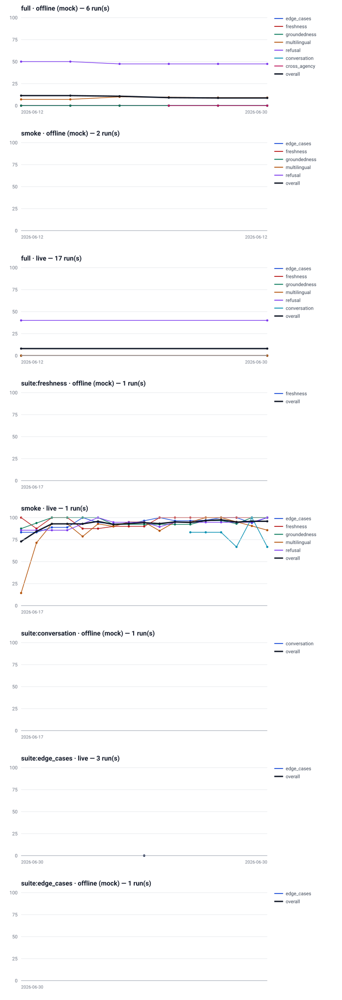

# Evaluation history

Every recorded eval run in `evals/runs/`, oldest first, on one page: per-suite pass rates, cost, duration, and each prompt-version bump. The run directories themselves are a local, gitignored archive; this rendered page (and the SVG) is the committed artifact. Regenerate with `make report` (or `python -m evals.history`).

> **Read within an instrument, never across.** Mock/offline runs are scored by deterministic checks against a mock answer model; live runs call a real answer and judge model. They are different instruments and measure different things, so the chart and tables below group runs by instrument (mode + offline/live) and never plot mock and live scores on the same series. Smoke and full runs differ in sample size too. Only the trajectory *within* one instrument is a like-for-like comparison.

## full · live — 4 run(s)

| Run (UTC) | Overall | conversation | cross_agency | edge_cases | freshness | groundedness | multilingual | refusal | sensitivity | stretch_tagalog | Est USD | Duration |
|---|---|---|---|---|---|---|---|---|---|---|---|---|
| `2026-08-15T09:42:35Z` | **79.2%** | 90.0% | 57.1% | 76.6% | 63.3% | 84.3% | 75.0% | 91.1% | 93.3% | 80.0% | $6.7691 | 649.6s |
| **↑ prompt bump:** system v20→v21 | | | | | | | | | | | | |
| `2026-08-15T18:58:41Z` | **55.0%** | 0.0% | 55.6% | 48.3% | 54.5% | 45.5% | 90.0% | 25.0% | 50.0% | 100.0% | $2.3266 | 125.5s |
| `2026-08-15T19:02:43Z` | **84.7%** | 60.0% | 76.2% | 81.5% | 80.0% | 84.3% | 95.0% | 88.9% | 90.0% | 100.0% | $7.4992 | 399.3s |
| `2026-08-15T19:17:06Z` | **84.9%** | 70.0% | 76.2% | 81.5% | 80.0% | 84.3% | 95.0% | 88.9% | 90.0% | 100.0% | $0.0051 | 5.4s |
